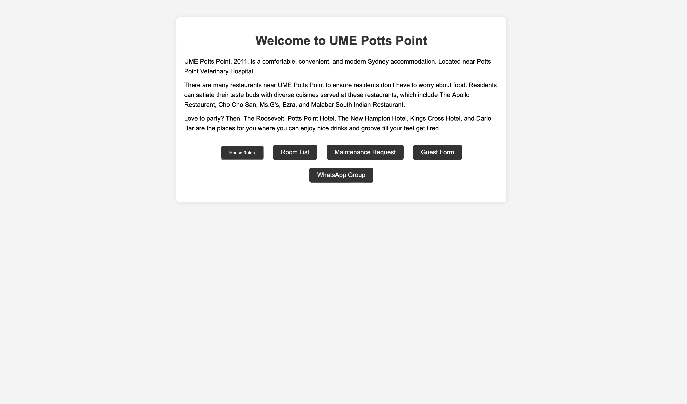

# UmePottsPoint

This project is a web application built using Flask for residents of <a href="https://www.ume.com.au"> UME Potts Point</a>.

## Features

- Responsive web form for submitting maintenance requests
- Stores submission data in a CSV file
- Data fields include resident's name, room number, problem description, and area/unit/room
- Automatic creation of new CSV files based on the current month and year


## Screenshot



## Prerequisites

- Python 3.6 or higher
- Flask library

## Installation

1. Clone the repository:
    ```bash
    git clone https://github.com/hemangsharma/UME-Potts-Point-Maintenance-Form.git
    cd UME-Potts-Point-Maintenance-Form
    ```

2. Create and activate a virtual environment:
    ```bash
    python -m venv venv
    source venv/bin/activate  # On Windows use `venv\Scripts\activate`
    ```

3. Install the required packages:
    ```bash
    pip install Flask
    ```

## Usage

1. Run the Flask application:
    ```bash
    python app.py
    ```

2. Open your web browser and navigate to `http://127.0.0.1:5000` to access the maintenance form.

3. Fill out the form with the necessary information and submit it. The data will be saved to a CSV file named with the current month and year (e.g., `July_2024.csv`).


## Security

To ensure the security of the CSV file, only the application server should have access to it. Do not expose the CSV file directly through the web server. Consider using appropriate file permissions and server configurations to protect the data.

## Contact

For any questions or inquiries, please contact sharmahemang2000@gmail.com.
